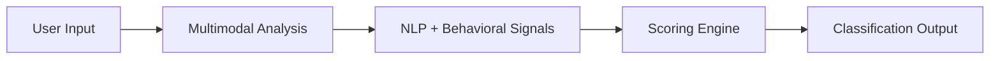

# ⚡ Attention-X AI

### 🧠 Viral Intelligence Engine

> Decode what truly deserves your attention in the Attention Economy.

---

## 🌐 Live Demo

🔗 https://attention-x-ai-hackathon.vercel.app/

## 🎥 Demo Video

👉 https://drive.google.com/file/d/1zZkpID0tiQ9saC4c8t1dNl1vd7BUxdKE/view

---

## 🧠 Problem Statement

We are living in the **Attention Economy**, where digital platforms compete for one thing:

> ⏳ **Your Time**

Platforms are optimized for engagement — not value.

### 🚨 The Problem:

* Viral content ≠ Valuable content
* High consumption, low learning
* No system to measure *true content value*

👉 The internet optimizes for **attention**, not **intelligence**.

---

## 💡 Solution — Attention-X AI

**Attention-X AI** is an AI-powered content intelligence system that answers:

> 🧠 *“Is this content worth your attention?”*

It analyzes content and classifies it into:

* ⚡ **Viral Distraction**
* 🧠 **Valuable Insight**

---

## 🔍 Key Features

### ⚡ Viral Signal Detection

Detects attention-grabbing patterns:

* Emotional hooks
* Clickbait structures
* Addictive loops

---

### 🧠 Wisdom Signal Detection

Evaluates meaningful depth:

* Information richness
* Learning value
* Cognitive impact

---

### 📊 Smart Scoring System

Generates:

* 🎯 **Attention Score**
* 🧠 **Wisdom Score**
* ⚖️ **Final Classification** (Viral vs Valuable)

---

### 🎨 Clean & Interactive UI

* Fast & responsive
* Real-time analysis
* User-friendly experience

---

## 🧪 How It Works

### ⚙️ Step-by-Step:

1. User inputs content (text/video/audio)
2. AI extracts multimodal signals
3. System analyzes:

   * NLP signals
   * Behavioral patterns
   * Attention heuristics
4. Generates scores & classification
5. Displays results in UI

---

## 🛠️ Tech Stack

| Layer      | Technology             |
| ---------- | ---------------------- |
| Frontend   | HTML, CSS, JavaScript  |
| Backend    | Python                 |
| AI Layer   | NLP + Heuristic Models |
| Deployment | Vercel                 |

---

## 🎯 Use Cases

🎓 **Students**
→ Avoid distractions & focus on learning

🎥 **Content Creators**
→ Build meaningful, high-impact content

🧠 **Researchers**
→ Analyze attention behavior

💻 **Developers**
→ Build ethical AI systems

---

## 🌍 Why This Matters

We are facing an **attention crisis**:

* 📉 Decreasing focus span
* 🔁 Endless scrolling loops
* 🧠 Reduced deep thinking

### 🔥 Our Vision:

> Not “What is trending?”
> But “What is worth your attention?”

---

## 🚀 Future Scope

* 🌐 Chrome Extension (real-time analysis)
* 📱 Mobile Application
* 🤖 Advanced Multimodal AI Models
* 🎯 Personalized Recommendations
* 📊 Creator Analytics Dashboard

---

## 🏆 Hackathon Value

✔️ Solves a real-world Attention Economy problem
✔️ Goes beyond basic AI → focuses on meaningful intelligence
✔️ Combines AI + Ethics + User Value
✔️ Scalable for real-world platforms

---

## 🧑‍💻 Author

**Abhishek Akhand**

🔗 GitHub:
https://github.com/abhishekakhand737/AttentionX-AI-Hackathon

🔗 LinkedIn:
https://www.linkedin.com/in/abhishek-akhand-391a19277

---

## ⭐ Support

If you found this project useful:
⭐ Star the repo
🚀 Share with others
💡 Contribute ideas

---

